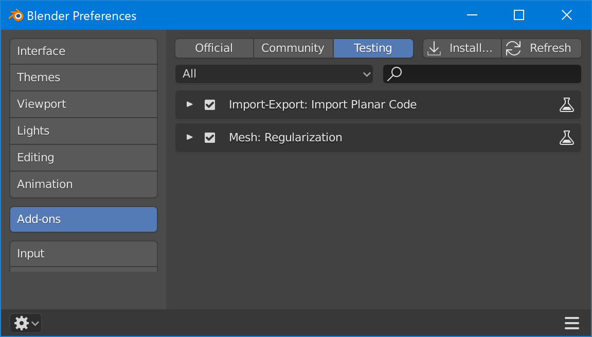
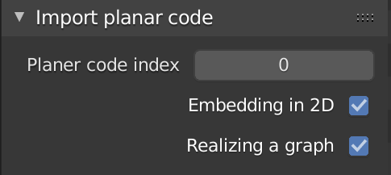

# planer_code-importer-blender
Blender addon for importing/reconstructing/realizing a graph structure in planar code format.

This branch is tested with Blender 2.8.

## How to use:

1. Install io_import_planar_code.py from Edit->Preferences in Blender.
2. Enable the addon (listed in Testing).

3. Then, menu item for Planer code (.*) will be added to File->Import. 
4. Import a graph at specified index. 

5. Reconstructed polyhedron will be added to the scene.

## Note
- This addon is tested with the planar code generated by Plantri <https://users.cecs.anu.edu.au/~bdm/plantri/> 
- Here is quick explanation of planar code

- We usee two step graph realization
  + Embed a graph into a plane using a spring model
  + Lift up the vertices inside the outer polygon
